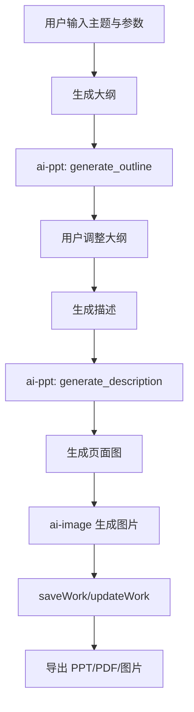

# AI PPT PRD 文档

> 产品需求文档 | 版本 1.0 | 最后更新：2026-02-13

## 1. 内容框架
- 输入层：主题内容（句子/大纲/描述）、页数、风格、模板、比例、线路。
- 处理层：先生成大纲，再生成逐页描述，再生成逐页图片。
- 输出层：可编辑 PPT 项目、批量页面图、导出文件（PPT/PDF/图片）。

## 2. 整体用途
- 把“文字需求”快速转为“可演示的完整 PPT”。
- 降低从内容构思到可交付演示稿的时间成本。

## 3. 流程（用户流程 + 后端流程）
### 3.1 用户流程
1. 选择输入模式并填写主题。
2. 设置页数/风格/模板后生成大纲。
3. 调整大纲并生成每页描述。
4. 逐页或批量生成视觉页。
5. 导出为 PPT/PDF/图片。

### 3.2 后端流程
1. 调用 `ai-ppt` Edge Function 生成大纲（`generate_outline`）。
2. 调用 `ai-ppt` 生成逐页描述（`generate_description`）。
3. 调用 `ai-image` 生成页面图。
4. 调用 `saveWork/updateWork` 持续保存项目状态。
5. 前端执行导出逻辑产出文件。

### 3.3 流程图


## 架构图（图片版）


## 4. 核心提示词（新增）

### 4.1 大纲生成 Prompt
来源：`supabase/functions/ai-ppt/index.ts`

```text
你是一个专业的PPT大纲生成助手。{按输入模式补充说明}
用户输入内容：{content}
请严格按照JSON格式返回...
要求：恰好{pageCount}页、每页3-5要点、首尾页有引导与总结。
```

### 4.2 单页描述 Prompt
来源：`supabase/functions/ai-ppt/index.ts`

```text
你是一个专业的PPT内容描述生成助手。
整体主题：{overallTheme}
当前页面：第{slideIndex}页 / 共{totalSlides}页
页面标题：{slideTitle}
大纲要点：{outlinePoints}
请生成：具体细节/文字内容/视觉元素建议/画面构想。
```

### 4.3 页面图片生成 Prompt 模板
来源：`src/lib/ai-ppt.ts`

```text
Create a professional presentation slide image.
{templatePrompt}{stylePrompt}
Content description:
{description}

Requirements:
- Clean, professional layout suitable for a presentation slide
- Clear visual hierarchy with title and key points
- Harmonious color scheme
- Modern design aesthetic
- Text should be in Chinese (简体中文)
- Aspect ratio: {aspectRatio}
```
