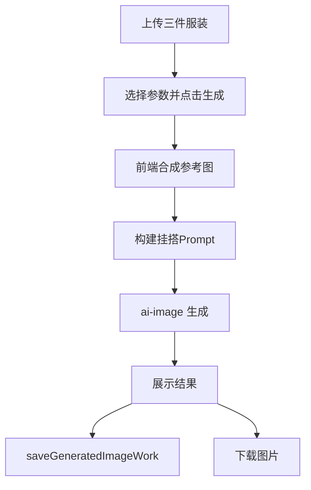
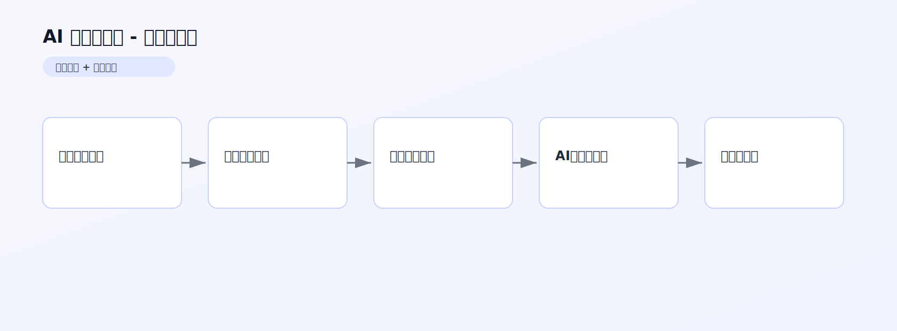

# AI 一键挂搭图 PRD 文档

> 产品需求文档 | 版本 1.0 | 最后更新：2026-02-13

## 1. 内容框架
- 输入层：内搭/上衣/裤子三张图 + 线路 + 补充说明。
- 处理层：三图合成参考图 + 挂搭场景 Prompt 组装。
- 输出层：高质感服装挂搭效果图。

## 2. 整体用途
- 快速把单品图转成“店铺可展示”的挂搭成片。
- 提升服装商品展示效率与视觉统一性。

## 3. 流程（用户流程 + 后端流程）
### 3.1 用户流程
1. 分别上传内搭、上衣、裤子。
2. 填写补充要求并选择生成线路。
3. 点击生成并预览结果。
4. 下载成图。

### 3.2 后端流程
1. 前端压缩并合并三张服装图。
2. 组装挂搭 Prompt + 负向 Prompt。
3. 调用 `ai-image` 生成结果图。
4. 调用 `saveGeneratedImageWork` 自动存档。

### 3.3 流程图


## 架构图（图片版）



## 4. 核心提示词（新增）

来源：`src/pages/AIOneClickOutfit.tsx`

### 4.1 主提示词（核心）
```text
[Core Setup: The "Grand" Rack]
A professional editorial fashion photograph...
- 3 件上传服装必须全部出现
- 每件衣服独立上衣架，禁止融合
- 强调真实材质、垂坠、细节
- 高级店铺环境，3:4 画幅
```

### 4.2 负向提示词（质量控制）
```text
[Crucial Removal]
studio equipment, light stands, messy environment...

[Quality Control]
cropped garments, low quality, distorted fabric,
merged garments, too many props...
```
