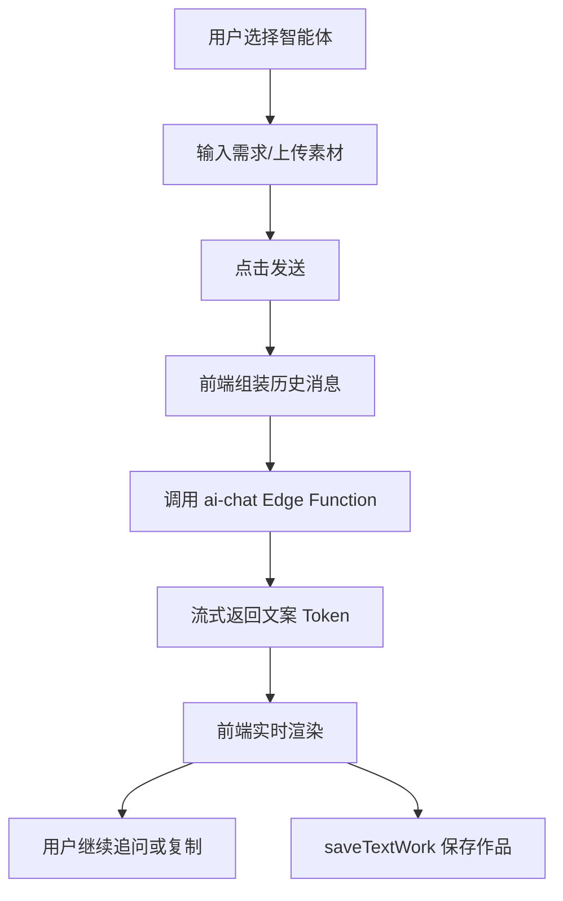

# AI 文案 PRD 文档

> 产品需求文档 | 版本 1.0 | 最后更新：2026-02-13

## 1. 内容框架
- 输入层：用户提示词 + 可选素材文件（图片/表格/文档）+ 智能体类型（小红书/抖音/公众号/广告/产品/通用）。
- 处理层：构建对话上下文（首轮或续写），调用流式 AI 文案生成。
- 输出层：实时流式文案结果、可复制文本、自动保存到作品库。

## 2. 整体用途
- 帮用户快速生成不同平台、不同风格的营销或内容文案。
- 支持多轮对话式改写，提高可用性与产出效率。

## 3. 流程（用户流程 + 后端流程）
### 3.1 用户流程
1. 选择文案智能体。
2. 输入需求（可附加素材文件）。
3. 点击发送并查看实时生成内容。
4. 继续追问优化，或复制结果。

### 3.2 后端流程
1. 前端整理历史消息与当前输入。
2. 调用 `ai-chat` Edge Function（流式返回 token）。
3. 前端持续渲染流式内容。
4. 生成完成后调用 `saveTextWork` 写入 `works`。

### 3.3 流程图


## 架构图（图片版）


## 4. 核心提示词（新增）

### 4.1 智能体系统提示词（后端）
来源：`supabase/functions/ai-chat/index.ts`

```text
xiaohongshu: 你是一个专业的小红书文案创作专家...
douyin: 你是一个专业的抖音短视频文案策划师...
weixin: 你是一个资深的微信公众号内容创作者...
ad: 你是一个资深的广告文案策划专家...
product: 你是一个专业的产品文案撰写专家...
general: 你是一个专业的文案创作助手...
```

### 4.2 前端一键优化补充词
来源：`src/pages/AICopywriting.tsx`

```text
xiaohongshu: ，要求：吸引眼球的标题、适当使用emoji、口语化表达、加入互动引导
douyin: ，要求：开头3秒抓住注意力、节奏感强、口语化、有记忆点
weixin: ，要求：深度有价值、逻辑清晰、金句点睛、引发思考
ad: ，要求：突出卖点、制造紧迫感、明确行动号召、简洁有力
product: ，要求：突出核心卖点、解决用户痛点、场景化描述、数据支撑
general: ，要求：表达清晰、结构完整、语言流畅、重点突出
```
