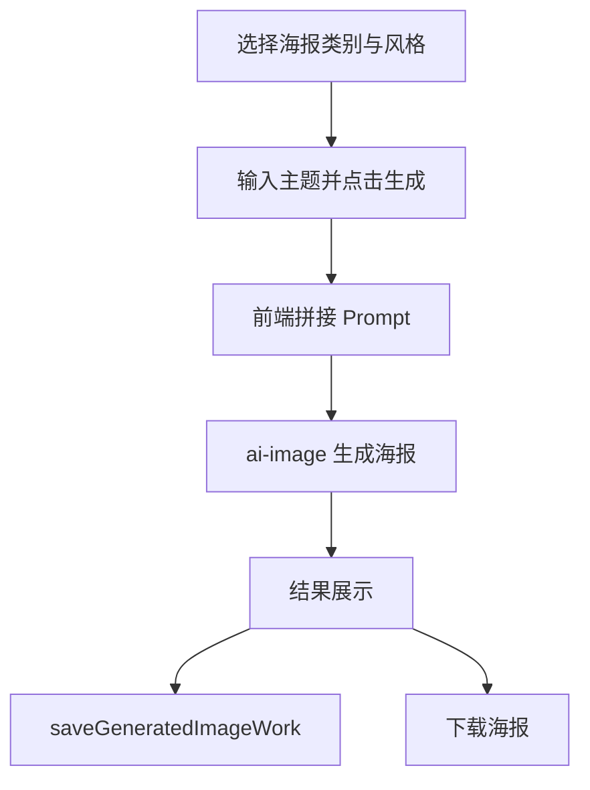

# AI 海报 PRD 文档

> 产品需求文档 | 版本 1.0 | 最后更新：2026-02-08

---

## 1. 概述

本文档详细记录 AI 海报功能的所有提示词、风格配置和参数设置，便于统一维护、版本迭代和效果优化。

**功能定位**：通过选择海报类别、风格和描述需求，使用 AI 生成符合商业场景的海报设计。

**代码文件**：`src/pages/AIPoster.tsx`

**核心差异**：
- **AI 绘图**：偏艺术创作，注重风格和美感
- **AI 海报**：偏商业设计，注重信息传达和营销效果

---

## 2. 海报类别 (Poster Categories)

### 2.1 类别列表

| ID | 名称 | 图标 | 说明 |
|---|---|---|---|
| ecommerce | 电商海报 | 🛒 | 促销、活动、新品上市 |
| social | 社交媒体 | 📱 | 小红书、朋友圈、公众号 |
| event | 活动海报 | 🎉 | 展会、会议、活动宣传 |
| brand | 品牌海报 | 🏢 | 品牌形象、企业宣传 |
| festival | 节日海报 | 🎊 | 节日祝福、节庆活动 |
| food | 美食海报 | 🍔 | 餐饮、美食、菜单 |

### 2.2 类别详解

#### 🛒 电商海报 (E-commerce)

**核心目标**：促销转化、吸引点击、引导下单

**基础提示词**：
```
e-commerce promotional poster design, clear product focus, prominent price display,
strong call-to-action, eye-catching discount badges, clean product photography style,
professional commercial layout, high conversion design
```

**核心特点**：
- 产品清晰突出
- 价格信息醒目
- 促销信息明显
- 引导行动明确

**适用场景**：
- 电商平台促销
- 新品上市宣传
- 限时折扣活动
- 爆款推荐

**推荐风格**：现代简约、扁平设计、大胆撞色

---

#### 📱 社交媒体 (Social Media)

**核心目标**：吸引眼球、引发分享、适配平台

**基础提示词**：
```
social media post design, attention-grabbing visual, shareable content layout,
mobile-optimized composition, trendy aesthetic, engaging typography,
platform-friendly format, Instagram/WeChat/Xiaohongshu style
```

**核心特点**：
- 视觉冲击力强
- 适合截图分享
- 文字清晰易读
- 符合平台调性

**适用场景**：
- 小红书笔记配图
- 朋友圈分享图
- 公众号封面图
- Instagram 帖子

**推荐风格**：扁平设计、现代简约、复古风格

---

#### 🎉 活动海报 (Event)

**核心目标**：传达活动信息、吸引参与、营造氛围

**基础提示词**：
```
event poster design, clear event information hierarchy, prominent date and location,
strong visual impact, festive atmosphere, professional event branding,
clear information structure with title/time/venue
```

**核心特点**：
- 活动主题突出
- 时间地点清晰
- 视觉层级分明
- 氛围感强烈

**适用场景**：
- 展会宣传
- 会议论坛
- 音乐节活动
- 线下聚会

**推荐风格**：大胆撞色、现代简约、优雅轻奢

---

#### 🏢 品牌海报 (Brand)

**核心目标**：传达品牌调性、建立品牌认知、专业大气

**基础提示词**：
```
brand identity poster design, professional corporate aesthetic, consistent brand tone,
logo prominence, sophisticated layout, premium quality feel,
brand storytelling visual, high-end commercial design
```

**核心特点**：
- 品牌调性统一
- Logo 位置合理
- 专业大气感
- 留白得当

**适用场景**：
- 品牌形象宣传
- 企业文化展示
- 产品系列发布
- 品牌故事传播

**推荐风格**：现代简约、优雅轻奢、极简设计

---

#### 🎊 节日海报 (Festival)

**核心目标**：营造节日氛围、传递祝福、引发情感共鸣

**基础提示词**：
```
festival celebration poster design, festive atmosphere, holiday-themed visual elements,
warm greeting message, cultural celebration aesthetic, joyful color palette,
seasonal decoration style, emotional connection design
```

**核心特点**：
- 节日元素丰富
- 祝福语醒目
- 色彩喜庆温暖
- 氛围浓厚

**适用场景**：
- 春节、中秋等传统节日
- 圣诞、新年等现代节日
- 情人节、母亲节等温馨节日
- 企业节日祝福

**推荐风格**：复古风格、优雅轻奢、扁平设计

---

#### 🍔 美食海报 (Food)

**核心目标**：激发食欲、展示美食、吸引到店

**基础提示词**：
```
food poster design, appetizing food photography style, vibrant color palette,
mouth-watering presentation, professional food styling, clear menu information,
restaurant branding, delicious visual appeal
```

**核心特点**：
- 色彩诱人
- 食物主体突出
- 食欲感强
- 品质感好

**适用场景**：
- 餐厅菜单设计
- 外卖平台宣传
- 美食节活动
- 新品推荐

**推荐风格**：现代简约、大胆撞色、优雅轻奢

---

## 3. 通用风格库 (Style Presets)

### 3.1 风格列表

所有海报类别都可以选择以下设计风格，风格提示词会添加到基础提示词之后。

**⚠️ 重要原则**：避免 AI 味，禁止使用渐变相关元素（gradient、colorful gradients 等）

| ID | 名称 | 图标 | 英文提示词 |
|---|---|---|---|
| modern | 现代简约 | ✨ | modern minimalist design, clean lines, elegant simplicity, solid colors, professional layout |
| flat | 扁平设计 | 📐 | flat design style, solid color blocks, no shadows, geometric shapes, contemporary aesthetic |
| retro | 复古风格 | 🎞️ | vintage retro style, nostalgic aesthetic, classic design, aged texture, timeless feel |
| minimal | 极简设计 | ⬜ | ultra minimalist, maximum white space, less is more, refined typography, sophisticated |
| bold | 大胆撞色 | 🎨 | bold color blocking, high contrast solid colors, striking visual, strong color palette |
| elegant | 优雅轻奢 | 💎 | elegant luxury design, sophisticated aesthetic, premium feel, refined details, high-end |

### 3.2 风格详解

#### ✨ 现代简约 (Modern Minimalist)

**核心特点**：
- 简洁的线条（clean lines）
- 优雅的简约感（elegant simplicity）
- 纯色设计（solid colors）
- 专业的布局（professional layout）

**适用场景**：科技产品、家居品牌、互联网公司、现代企业

**与极简设计的区别**：现代简约保留必要的设计元素，而极简设计追求极致的留白和简化

---

#### 📐 扁平设计 (Flat Design)

**核心特点**：
- 纯色色块（solid color blocks）
- 无阴影效果（no shadows）
- 几何图形（geometric shapes）
- 当代美学（contemporary aesthetic）

**适用场景**：互联网产品、APP 宣传、年轻化品牌、科技公司

**设计理念**：去除拟物化效果，使用纯色和几何图形，强调扁平化和现代感

---

#### 🎞️ 复古风格 (Vintage Retro)

**核心特点**：
- 怀旧氛围（nostalgic aesthetic）
- 经典设计（classic design）
- 年代质感（aged texture）
- 永恒感觉（timeless feel）

**适用场景**：传统节日、怀旧主题、经典品牌、文化活动

**设计理念**：通过复古元素和色调营造年代感和情怀

---

#### ⬜ 极简设计 (Ultra Minimalist)

**核心特点**：
- 极致留白（maximum white space）
- 少即是多（less is more）
- 精致排版（refined typography）
- 高级感（sophisticated）

**适用场景**：高端品牌、建筑设计、艺术展览、奢侈品

**设计理念**：通过极致的简化和留白，传达高级感和品质感

---

#### 🎨 大胆撞色 (Bold Color Blocking)

**核心特点**：
- 大胆的色块（bold color blocking）
- 高对比纯色（high contrast solid colors）
- 强烈视觉冲击（striking visual）
- 强烈的色彩组合（strong color palette）

**适用场景**：促销活动、音乐节、年轻化产品、吸引眼球的场景

**设计理念**：使用高对比度的纯色色块，而非渐变，创造视觉冲击力

**⚠️ 注意**：强调的是纯色之间的对比，不是渐变过渡

---

#### 💎 优雅轻奢 (Elegant Luxury)

**核心特点**：
- 优雅的奢华设计（elegant luxury design）
- 精致的美学（sophisticated aesthetic）
- 高端质感（premium feel）
- 精致的细节（refined details）

**适用场景**：高端产品、奢侈品、精品酒店、高档餐厅

**设计理念**：通过精致的细节和高级的配色，传达品质感和奢华感

---

## 4. 尺寸选项 (Size Options)

### 4.1 尺寸列表

| ID | 名称 | 比例 | 适用场景 |
|---|---|---|---|
| square | 正方形 | 1:1 | 社交媒体头像、Instagram 帖子 |
| portrait | 竖版 | 3:4 | 海报、宣传单、竖版设计 |
| landscape | 横版 | 4:3 | 电脑壁纸、演示文稿（默认） |
| story | 故事 | 9:16 | 手机壁纸、短视频、Stories |
| banner | 横幅 | 16:9 | 视频封面、横版海报、网站横幅 |

### 4.2 默认设置

- **默认尺寸**：`1:1`（正方形）- 适合大多数社交媒体平台

---

## 5. 提示词组合逻辑

### 5.1 最终提示词构建规则

```javascript
// 伪代码
finalPrompt = [
  categoryPrompt,        // 海报类别基础提示词（必选）
  userPrompt,           // 用户输入的提示词（必选）
  stylePrompt           // 风格提示词（可选）
].filter(Boolean).join(', ')
```

### 5.2 优先级说明

1. **海报类别提示词**（最前）：定义海报的基本属性和目标
2. **用户输入**（中间）：用户描述的具体内容和需求
3. **风格提示词**（最后）：用户选择的设计风格

### 5.3 示例

**场景 1**：电商海报 + 用户输入「双十一促销，运动鞋，红色背景」+ 大胆撞色

**最终提示词**：
```
e-commerce promotional poster design, clear product focus, prominent price display,
strong call-to-action, eye-catching discount badges, clean product photography style,
professional commercial layout, high conversion design, 双十一促销，运动鞋，红色背景,
bold color blocking, high contrast solid colors, striking visual, strong color palette
```

**场景 2**：美食海报 + 用户输入「意大利披萨，新品推荐」+ 优雅轻奢

**最终提示词**：
```
food poster design, appetizing food photography style, vibrant color palette,
mouth-watering presentation, professional food styling, clear menu information,
restaurant branding, delicious visual appeal, 意大利披萨，新品推荐,
elegant luxury design, sophisticated aesthetic, premium feel, refined details, high-end
```

---

## 6. 一键优化功能

### 6.1 优化规则

用户点击「一键优化」按钮时，会根据不同海报类别在原有提示词后追加特定要求：

| 海报类别 | 追加内容 |
|---------|---------|
| 电商海报 | ，要求：突出促销信息、价格醒目、产品清晰、引导下单 |
| 社交媒体 | ，要求：吸引眼球、适合分享、比例适配、风格年轻化 |
| 活动海报 | ，要求：活动主题突出、时间地点清晰、视觉冲击力强 |
| 品牌海报 | ，要求：品牌调性统一、专业大气、logo突出 |
| 节日海报 | ，要求：节日氛围浓厚、祝福语醒目、喜庆热闹 |
| 美食海报 | ，要求：色彩诱人、食欲感强、主体突出 |

**代码位置**：`AIPoster.tsx` 第 96-108 行

---

## 7. 技术参数

### 7.1 API 调用参数

```typescript
interface GeneratePosterParams {
  prompt: string;              // 最终组合的提示词
  category: string;            // 海报类别 ID
  styleId?: string;            // 风格 ID（如果选择）
  aspectRatio: string;         // 图片比例（如 "1:1"）
  referenceImage?: string;     // 参考图片（base64）
}
```

### 7.2 相关代码文件

| 功能 | 文件路径 | 说明 |
|---|---|---|
| 主页面 | `src/pages/AIPoster.tsx` | AI 海报主界面 |
| 图片生成 | `src/lib/ai-image.ts` | API 调用逻辑 |
| 图片处理 | `src/lib/image-utils.ts` | 图片处理工具 |

---

## 8. 用户交互流程

### 8.1 基础流程

1. 用户选择海报类别（电商/社交媒体/活动/品牌/节日/美食）
2. 用户选择设计风格（可选：现代简约/扁平设计/复古风格等）
3. 用户选择尺寸比例（1:1 / 3:4 / 4:3 / 9:16 / 16:9）
4. 用户输入文字描述或上传参考图片
5. 用户点击「一键优化」（可选）
6. 用户点击发送按钮生成海报
7. 系统显示生成结果
8. 用户可以下载或重新生成

### 8.2 快捷操作

- **Enter 键**：发送生成（Shift+Enter 换行）
- **上传参考图**：支持上传产品图、logo 等素材
- **上传到素材库**：支持批量上传素材（待实现）

---

## 9. 移动端适配

### 9.1 触摸优化

- 所有按钮添加 `touch-target` 类，确保触摸区域足够大
- 下拉菜单支持触摸操作
- 图片预览支持触摸缩放

### 9.2 响应式设计

- 移动端优化布局，按钮和文字大小适配
- 下拉菜单在移动端自动调整位置
- 生成结果区域高度自适应

---

## 10. 版本迭代记录

| 版本 | 日期 | 变更说明 |
|---|---|---|
| v1.0 | 2026-02-08 | 初始版本，定义 6 大海报类别和 6 种设计风格 |

**v1.0 核心原则**：
- ✅ 避免 AI 味，禁止使用渐变元素
- ✅ 所有风格强调纯色（solid colors）和色块（color blocks）
- ✅ 提示词注重商业设计效果，而非艺术创作
- ✅ 每个类别都有明确的核心目标和适用场景

---

## 11. 待优化项

### 11.1 提示词优化

- [ ] 根据实际生成效果调整各类别的基础提示词
- [ ] 测试不同风格与类别的组合效果
- [ ] 添加负面提示词（negative prompts）功能
- [ ] 支持提示词权重调整

### 11.2 功能增强

- [ ] 实现素材库上传和管理功能
- [ ] 支持批量生成（一次生成多张）
- [ ] 支持历史记录保存
- [ ] 支持收藏功能
- [ ] 支持分享到社交媒体
- [ ] 添加更多海报类别（如：教育、医疗、房地产等）

### 11.3 风格扩展

- [ ] 考虑添加更多商业设计风格（如：科技感、手绘插画等）
- [ ] 支持自定义风格（用户可以保存自己的风格预设）
- [ ] 从数据库动态加载风格（类似 AI 绘图）

### 11.4 用户体验

- [ ] 添加风格预览图
- [ ] 添加提示词示例
- [ ] 添加生成历史记录
- [ ] 添加快捷提示词标签
- [ ] 添加海报模板库（预设的优秀案例）

---

## 12. 常见问题 (FAQ)

### Q1: AI 海报和 AI 绘图有什么区别？
A: AI 绘图偏向艺术创作，注重风格和美感；AI 海报偏向商业设计，注重信息传达和营销效果。海报更强调实用性和转化率。

### Q2: 为什么不使用渐变风格？
A: 渐变色是 AI 生成图像的常见特征，容易让设计看起来很"AI 感"。商业海报需要更专业、更真实的设计效果，因此我们使用纯色和色块设计。

### Q3: 如何选择合适的海报类别？
A:
- 电商促销、新品上市 → 电商海报
- 社交平台分享 → 社交媒体
- 线下活动宣传 → 活动海报
- 品牌形象展示 → 品牌海报
- 节日祝福 → 节日海报
- 餐饮美食 → 美食海报

### Q4: 如何选择合适的设计风格？
A:
- 科技、互联网 → 现代简约、扁平设计
- 高端品牌 → 优雅轻奢、极简设计
- 促销活动 → 大胆撞色、扁平设计
- 传统节日 → 复古风格
- 年轻化产品 → 扁平设计、大胆撞色

### Q5: 可以同时选择多个风格吗？
A: 目前只能选择一个设计风格，但可以在用户输入中手动添加更多风格描述。

---

## 13. 相关文档

- [AI 绘图 PRD](./PRD-AI绘图.md) - AI 绘图功能文档
- [AI 海报代码](../src/pages/AIPoster.tsx) - 功能实现代码
- [图片生成 API](../src/lib/ai-image.ts) - API 调用逻辑
- [图片工具库](../src/lib/image-utils.ts) - 图片处理工具

---

> **文档维护**：项目开发团队
> **最后更新**：2026-02-08
> **文档版本**：v1.0

---

## 10. 简版流程总览（补充）

### 10.1 内容框架
- 输入：海报类别、风格、用户描述、可选参考图。
- 处理：类别 Prompt + 用户描述 + 风格 Prompt 拼接。
- 输出：可下载的海报图，并自动存档到作品库。

### 10.2 整体用途
- 面向营销场景快速生成可投放海报，提升内容产出效率。

### 10.3 流程（用户 + 后端）
1. 用户选择类别/风格并输入需求。
2. 前端组装最终 Prompt 并调用 `ai-image`。
3. 返回图片后展示结果并调用 `saveGeneratedImageWork` 保存。



## 架构图（图片版）


