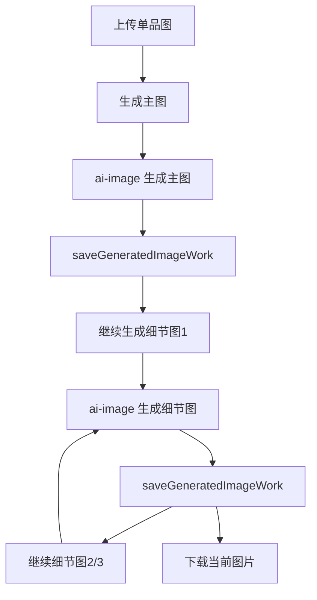
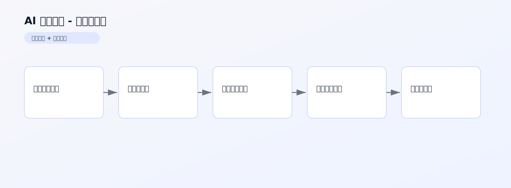

# AI 细节特写 PRD 文档

> 产品需求文档 | 版本 1.0 | 最后更新：2026-02-13

## 1. 内容框架
- 输入层：单品参考图（外套/上衣/裤装）。
- 处理层：先生成主图，再按固定槽位生成 3 张细节图（结构/元素/工艺纹理），细节内容必须来自衣服真实存在的局部元素。
- 输出层：1 张主图 + 3 张细节特写，形成完整商品展示组图。

## 2. 整体用途
- 用于电商详情页“主图 + 细节图”自动化生产。
- 保证同一单品在多图中的视觉一致性。

## 3. 流程（用户流程 + 后端流程）
### 3.1 用户流程
1. 上传单品参考图。
2. 点击生成主图。
3. 依次点击继续生成细节图 1/2/3。
4. 预览并下载每一张图。

### 3.2 后端流程
1. 用参考图调用 `ai-image` 生成主图。
2. 以“参考图 + 主图”为输入，逐次生成细节图。
3. 每次生成后调用 `saveGeneratedImageWork` 保存。
4. 前端维护当前图序与浏览状态。

### 3.3 流程图


## 架构图（图片版）



## 4. 核心提示词（新增）

来源：`src/pages/FashionDetailFocus.tsx`

### 4.1 主图 Prompt（`buildMainPrompt`）
```text
你是高端时尚电商摄影总监。请基于参考图，生成一张“高级感完整主图”。
要求：
- 只允许同一件单品，版型颜色纹理一致
- 自动识别品类并完整展示结构
- 商业成片感强，禁止水印/文字/杂物
```

### 4.2 细节图 Prompt（`buildDetailPrompt`）
```text
你是高端时尚摄影师。现在要生成第 {index} 张细节特写图（近景）。
细节任务：{slot.instruction}
要求：
- 同一件单品，不可变款变色
- 细节主体占画面60%以上
- 只允许拍摄参考图和主图中真实存在的细节，不存在的元素必须自动跳过
- 质感真实，光线与主图一致
```
