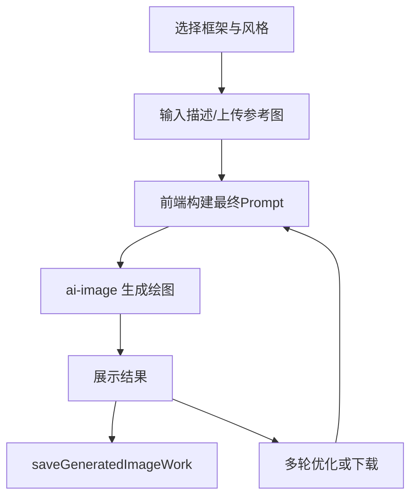

# AI 绘图 PRD 文档

> 产品需求文档 | 版本 2.0 | 最后更新：2026-02-08

---

## 1. 概述

本文档详细记录 AI 绘图功能的所有提示词、风格配置和参数设置，便于统一维护、版本迭代和效果优化。

**功能定位**：通过文字描述或上传参考图片，使用 AI 生成符合用户需求的图像。

**代码文件**：`src/pages/AIDrawing.tsx`

**架构说明**：采用两层选择系统
- **第一层（内容框架）**：定义内容的组织结构（如漫画故事、流程图、对比分析等）
- **第二层（视觉风格）**：定义视觉呈现风格（如可爱风、Q版、水彩风等）

---

## 2. 内容框架 (Content Frameworks) - 第一层

内容框架定义了内容的组织结构和布局方式，用户可以选择不同的框架来呈现内容。

### 2.1 框架列表

| ID | 名称 | 图标 | 说明 | 自动比例 |
|---|---|---|---|---|
| free | 自由模式 | ✍️ | 无框架限制，完全自由创作 | - |
| sketch | 手绘风格 | 🖌️ | 手账风格海报插画 | - |
| comic-story | 漫画故事 | 📖 | 分镜叙事，连续漫画格子 | - |
| flowchart | 流程图 | 🔄 | 流程图结构，箭头连接 | - |
| mindmap | 思维导图 | 🧠 | 中心辐射结构 | - |
| infographic | 图文并茂 | 📊 | 信息图表，图文结合 | - |
| comparison | 对比分析 | ⚖️ | 左右对比，VS 结构 | - |
| fashion-outfit | 女装搭配 | 👗 | 网格平铺搭配图 | 9:16 |
| outfit-model | 女装搭配模特图 | 👗 | 层叠式平铺搭配图 | 9:16 |

### 2.2 框架详解

#### ✍️ 自由模式 (free)
**提示词**：无

**说明**：
- 没有任何框架限制
- AI 会根据用户描述自由创作
- 可能生成单张插图、场景图、人物肖像等任何形式

**适用场景**：需要精确控制生成效果，或不需要特定结构时使用

---

#### 🖌️ 手绘风格 (sketch)
**提示词**：
```
Create a hand-drawn style poster illustration.

【STYLE - Hand-drawn Journal Aesthetic】
- Hand-drawn illustration style, like a cute travel journal or planner
- Clean sketch aesthetic with soft pastel colors
- Doodle icons and decorative elements
- Whimsical hand-lettering for titles and text
- Cozy, warm illustration style
- White or light cream background

【COMPOSITION】
- Clear visual hierarchy with main title at top
- Organized sections with cute dividers
- Small illustrated icons and doodles scattered throughout
- Balance between text areas and illustrations
- Easy to read layout

【TECHNICAL REQUIREMENTS】
1. Soft, harmonious color palette (pastels preferred)
2. Clean lines, not messy or over-sketched
3. Include relevant illustrated elements based on the topic
4. Professional but approachable hand-drawn look
5. NO photorealistic elements
6. NO AI-generated perfection - keep it warm and human

User request: {user_prompt}
```

**核心特点**：
- 手账风格插画
- 柔和的粉彩色调
- 涂鸦图标和装饰元素
- 手写字体标题
- 温馨舒适的风格

**适用场景**：旅游攻略、美食推荐、生活记录、手账风格海报

---

#### 📖 漫画故事 (comic-story)
**提示词**：
```
manga/comic story narrative layout with SEQUENTIAL PANELS:
1) 4-8 comic panels arranged in reading order (left-to-right, top-to-bottom),
2) each panel tells part of the story with characters, scenes, and actions,
3) speech bubbles and thought bubbles with dialogue/narration,
4) expressive character faces showing emotions,
5) dynamic poses and action lines for movement,
6) panel transitions showing story progression,
7) sound effects text (e.g., 'BOOM', 'whoosh'),
8) varied panel sizes for pacing and emphasis,
9) clear narrative flow that tells a complete mini-story about the topic.
```

**核心特点**：
- 4-8 个连续的漫画分镜
- 对话气泡和旁白
- 表情丰富的角色
- 动态姿势和动作线
- 音效文字
- 不同大小的分格控制节奏

**适用场景**：故事讲述、教程说明、概念解释、读书笔记

**与自由模式的区别**：
- 自由模式：单张图片
- 漫画故事：多格漫画，有故事情节

---

#### 🔄 流程图 (flowchart)
**提示词**：
```
professional flowchart diagram structure:
1) MULTIPLE BOXES with clear directional arrows showing flow and relationships,
2) central main topic box,
3) varied box shapes and sizes for visual hierarchy,
4) mix of solid and dashed connecting lines,
5) color-coded sections,
6) organized layout showing step-by-step process or relationships.
```

**核心特点**：
- 多个框图，箭头连接
- 中心主题框
- 不同形状和大小的框
- 实线和虚线连接
- 颜色编码分区

**适用场景**：流程说明、步骤指南、决策树、系统架构

---

#### 🧠 思维导图 (mindmap)
**提示词**：
```
comprehensive mind map structure:
1) central concept box with large emphasis,
2) radiating branches where each node connects to related concepts,
3) visual connections using arrows and lines (solid and dashed),
4) color coding for different branches,
5) varied sizes for hierarchy,
6) dense information layout showing relationships and connections.
```

**核心特点**：
- 中心概念框
- 辐射状分支
- 节点连接相关概念
- 颜色编码不同分支
- 层级大小变化

**适用场景**：知识整理、头脑风暴、概念关系、学习笔记

---

#### 📊 图文并茂 (infographic)
**提示词**：
```
detailed infographic layout:
1) MULTIPLE BOXES each containing BOTH relevant illustrations/icons AND concise text descriptions (60% images, 40% text),
2) clear hierarchical structure with main title at top,
3) various sized rectangular frames connected by arrows,
4) visual hierarchy using different box sizes and colors,
5) proper visual labels and annotations,
6) organized layout showing relationships and flow.
```

**核心特点**：
- 多个框图，图文结合（60% 图 + 40% 文字）
- 清晰的层级结构
- 不同大小的矩形框
- 箭头连接
- 视觉标签和注释

**适用场景**：信息图表、数据可视化、知识卡片、教程说明

---

#### ⚖️ 对比分析 (comparison)
**提示词**：
```
professional comparison analysis layout with SIDE-BY-SIDE structure:
1) TITLE at top center showing 'A vs B' or 'A 对比 B',
2) TWO MAIN COLUMNS divided by a vertical line or VS symbol in the middle,
3) LEFT COLUMN for Item A with icon/illustration at top,
4) RIGHT COLUMN for Item B with icon/illustration at top,
5) COMPARISON ROWS showing key dimensions (price, features, pros/cons, performance, design, etc.),
6) each row aligned horizontally across both columns for easy comparison,
7) use different background colors or borders to distinguish the two items (e.g., blue tint for left, orange tint for right),
8) include visual indicators like checkmarks ✓ for advantages, X marks for disadvantages, or star ratings,
9) summary section at bottom highlighting key differences,
10) clean table-like structure with clear labels.
CRITICAL: Make it easy to scan and compare - align corresponding features horizontally, use consistent spacing, and maintain visual balance between both sides.
```

**核心特点**：
- 左右分栏布局
- 中间 VS 分隔符
- 水平对齐的对比行
- 不同背景色区分
- 视觉指示器（✓ ✗ ⭐）
- 底部总结关键差异

**适用场景**：产品对比、概念对比、方案对比、技术对比、服务对比

**示例**：
- 苹果手机 vs 三星手机
- React vs Vue
- 方案A vs 方案B
- iOS vs Android

---

#### 👗 女装搭配 (fashion-outfit)
**提示词**：
```
创建一张专业的女装平铺搭配图(flat lay)。

【关键布局规则 - 必须遵守】
- 每件服装单品必须单独、独立展示
- 所有单品按网格布局排列，单品之间必须有清晰的间隔
- 禁止重叠、禁止层叠、禁止堆叠
- 每件单品平铺展示，从上到下完整可见
- 布局参考：杂志lookbook风格、Pinterest穿搭网格图

【女装风格要求】
- 配饰：精致优雅（珍珠耳环、细链项链、丝巾、精致手表、时尚墨镜等）
- 鞋子：女性化风格（高跟鞋、芭蕾平底鞋、尖头鞋、优雅凉鞋、小白鞋等）
- 整体风格：优雅、精致、女人味、时髦感

【技术要求】
1. 分析上传服装的颜色和风格，选择和谐的纯色背景（柔和高级色调如奶油色、浅灰色、淡粉色）
2. 根据服装风格，智能添加：
   - 一件女性配饰（选择最能提升整体精致感的）
   - 一双女鞋（选择最能完善整套look的）
3. 所有单品分散平铺排列，每件单品之间保持清晰间隔
4. 每件单品带柔和自然投影，专业产品摄影质感
5. 无文字、无水印、无模特、无人台
6. 竖版 9:16 比例

风格参考：Pinterest穿搭平铺图、时尚杂志单品展示、lookbook造型图
```

**核心特点**：
- 网格平铺布局
- 单品独立展示
- 智能补充配饰和鞋子
- 专业产品摄影质感
- 自动设置 9:16 比例

**适用场景**：女装搭配、服装展示、穿搭推荐

---

#### 👗 女装搭配模特图 (outfit-model)
**提示词**：
```
Create a professional flat-lay fashion outfit image in elegant layered style.

【LAYOUT - CRITICAL - Follow the reference image style exactly】
- Jacket/Outerwear: Open and spread wide at the TOP, showing inner lining if any
- Inner top/T-shirt: Positioned UNDER the jacket, centered, partially visible
- Pants: Laid BELOW, with the waistband slightly tucked under the inner top
- Shoes: ONE pair placed at the bottom corner, angled naturally
- Accessory: Add ONE small accessory (watch, bracelet, or sunglasses) near the shoes

【COMPOSITION STYLE】
- Items should OVERLAP naturally like a styled flat-lay, NOT separated in a grid
- Create visual depth with layering: outer > inner > bottom
- Overall aesthetic: Pinterest outfit inspo, fashion blogger style, Instagram flatlay

【COLOR & BACKGROUND】
- Analyze uploaded clothing colors and choose a harmonious SOLID background
- Background options: warm beige, soft cream, light gray, or muted blush
- The background should complement the clothing palette

【TECHNICAL REQUIREMENTS】
1. Based on the uploaded clothing style, intelligently ADD:
   - ONE pair of matching shoes (sneakers, loafers, heels - whatever fits the vibe)
   - ONE small accessory that elevates the look
2. Soft natural shadows for depth and dimension
3. Professional product photography quality, clean and polished
4. NO text, NO watermarks, NO models, NO mannequins
5. Vertical 9:16 aspect ratio

User uploaded clothing items: {user_prompt}
```

**核心特点**：
- 层叠式平铺布局
- 外套盖内搭的自然叠放
- 智能补充鞋子和配饰
- Pinterest/Instagram 风格
- 自动设置 9:16 比例

**适用场景**：女装搭配、时尚博主风格、穿搭灵感

**与女装搭配的区别**：
- 女装搭配：网格布局，单品独立
- 女装搭配模特图：层叠布局，自然叠放

---

## 3. 视觉风格 (Visual Styles) - 第二层

视觉风格定义了图像的视觉呈现方式，可以与任何内容框架组合使用。

### 3.1 风格列表

| ID | 名称 | 图标 | 说明 |
|---|---|---|---|
| default | 默认风格 | 🎭 | 无特殊风格 |
| cute | 可爱风 | 🎀 | 粉彩色调，柔和温馨 |
| chibi | Q版 | 🧸 | 大头小身体，卡通风格 |
| minimalist | 简约风 | ✨ | 简洁线条，留白艺术 |
| watercolor | 水彩风 | 🎨 | 水彩晕染，艺术感 |
| vintage | 复古风 | 📜 | 怀旧色调，经典质感 |

### 3.2 风格详解

#### 🎭 默认风格 (default)
**提示词**：无

**说明**：不添加任何特殊视觉风格，保持内容框架的原始效果

---

#### 🎀 可爱风 (cute)
**提示词**：
```
Visual style: kawaii cute aesthetic with
1) pastel colors (pink, lavender, mint, peach),
2) rounded shapes and soft edges,
3) cute decorative elements (hearts, stars, sparkles),
4) soft lighting and gentle features,
5) dreamy atmosphere,
6) playful and friendly appearance.
```

**核心特点**：
- 粉彩色调（粉色、薰衣草、薄荷、桃色）
- 圆润形状和柔和边缘
- 可爱装饰元素（爱心、星星、闪光）
- 柔光效果
- 梦幻氛围

**适用场景**：少女风、温馨场景、治愈系作品

**组合示例**：
- 漫画故事 + 可爱风 = 粉色可爱的漫画分镜
- 流程图 + 可爱风 = 粉彩色调的流程图

---

#### 🧸 Q版 (chibi)
**提示词**：
```
Visual style: chibi Q-version cartoon style with
1) bold outlines and simplified features,
2) oversized heads and small bodies,
3) exaggerated expressions,
4) bright vibrant colors,
5) playful and cute character representations,
6) cartoon aesthetic with rounded shapes.
```

**核心特点**：
- 粗线条轮廓
- 大头小身体（2:1 比例）
- 夸张表情
- 明亮鲜艳的颜色
- 卡通化风格

**适用场景**：Q版人物、卡通形象、表情包、游戏角色

**组合示例**：
- 漫画故事 + Q版 = Q版卡通风格的漫画
- 对比分析 + Q版 = Q版角色对比图

---

#### ✨ 简约风 (minimalist)
**提示词**：
```
Visual style: minimalist clean aesthetic with
1) simple elegant lines and geometric shapes,
2) monochromatic or limited color palette (black, white, one accent color),
3) plenty of white space for clarity,
4) clean straight lines,
5) 'less is more' principle,
6) modern and sophisticated look.
```

**核心特点**：
- 简洁优雅的线条
- 单色或有限色彩（黑白+一个强调色）
- 大量留白
- 清晰直线
- 少即是多
- 现代精致感

**适用场景**：现代设计、品牌视觉、极简插画、商务场景

**组合示例**：
- 流程图 + 简约风 = 极简风格的流程图
- 对比分析 + 简约风 = 简洁清晰的对比图

---

#### 🎨 水彩风 (watercolor)
**提示词**：
```
Visual style: watercolor artistic aesthetic with
1) soft watercolor washes and flowing colors,
2) artistic color blending and gradients,
3) watercolor splashes and organic textures,
4) soft edges and natural flow,
5) painted artistic quality,
6) gentle and artistic appearance.
```

**核心特点**：
- 柔和的水彩晕染
- 艺术色彩混合和渐变
- 水彩飞溅和有机质感
- 柔和边缘
- 绘画艺术质感

**适用场景**：艺术插画、文艺作品、手绘风格

**组合示例**：
- 漫画故事 + 水彩风 = 水彩风格的漫画
- 思维导图 + 水彩风 = 艺术感的思维导图

---

#### 📜 复古风 (vintage)
**提示词**：
```
Visual style: vintage retro aesthetic with
1) nostalgic warm tones (sepia, cream, brown, muted colors),
2) ornate decorative borders and flourishes,
3) aged paper texture,
4) classic typography,
5) retro ornamental elements,
6) nostalgic and timeless appearance.
```

**核心特点**：
- 怀旧暖色调（棕褐色、奶油色、棕色）
- 华丽装饰边框和花纹
- 陈旧纸张质感
- 经典字体
- 复古装饰元素

**适用场景**：复古海报、怀旧主题、年代感作品

**组合示例**：
- 手绘风格 + 复古风 = 复古手账风格
- 对比分析 + 复古风 = 复古风格的对比图

---

## 4. 组合使用示例

### 4.1 组合逻辑

**最终提示词 = 语言要求 + 内容框架提示词 + 用户输入 + 视觉风格提示词**

### 4.2 组合示例

| 内容框架 | 视觉风格 | 效果 |
|---|---|---|
| 漫画故事 | 可爱风 | 粉色可爱的漫画分镜 |
| 漫画故事 | Q版 | Q版卡通风格的漫画 |
| 漫画故事 | 水彩风 | 水彩艺术风格的漫画 |
| 流程图 | 简约风 | 极简风格的流程图 |
| 流程图 | 可爱风 | 粉彩色调的流程图 |
| 对比分析 | 简约风 | 简洁清晰的对比图 |
| 对比分析 | Q版 | Q版角色对比图 |
| 思维导图 | 水彩风 | 艺术感的思维导图 |
| 手绘风格 | 复古风 | 复古手账风格 |

### 4.3 使用建议

**想要单张精美插图**：
- 自由模式 + 任意视觉风格

**想要讲故事**：
- 漫画故事 + 可爱风/Q版/水彩风

**想要教程/步骤**：
- 流程图/思维导图 + 简约风/可爱风

**想要对比分析**：
- 对比分析 + 简约风/Q版

**想要信息图表**：
- 图文并茂 + 简约风/可爱风

---

## 5. 图片比例 (Aspect Ratios)

### 5.1 比例选项

| ID | 名称 | 说明 | 适用场景 |
|---|---|---|---|\n| 1:1 | 正方形 | 1:1 | 社交媒体头像、Instagram 帖子 |
| 4:3 | 横向标准 | 4:3 | 电脑壁纸、演示文稿（默认） |
| 16:9 | 横向宽屏 | 16:9 | 视频封面、横版海报 |
| 9:16 | 竖向全屏 | 9:16 | 手机壁纸、短视频、女装搭配图 |

### 5.2 自动比例设置

某些框架会自动设置推荐比例：
- **女装搭配**：自动设置为 `9:16`
- **女装搭配模特图**：自动设置为 `9:16`

### 5.3 默认设置

- **默认比例**：`4:3`（横向标准）

---

## 6. 其他参数

### 6.1 线路选择

| ID | 名称 | 说明 |
|---|---|---|
| standard | 普通线路 | 标准生成速度和质量（默认） |
| premium | 优质线路 | 更高质量，可能速度稍慢 |

**默认线路**：`standard`

### 6.2 语言选择

| ID | 名称 | 图标 |
|---|---|---|
| zh | 中文 | 🇨🇳 |
| en | English | 🇺🇸 |

**默认语言**：`zh`（中文）

**语言要求提示词**：
- 中文：`IMPORTANT: ALL text in the image must be in Chinese (Simplified Chinese characters only). Do not mix English with Chinese. Use pure Chinese for all labels, titles, descriptions, and annotations.`
- 英文：`IMPORTANT: ALL text in the image must be in English only. Do not mix Chinese with English. Use pure English for all labels, titles, descriptions, and annotations.`

---

## 7. 版本迭代记录

| 版本 | 日期 | 变更说明 |
|---|---|---|\n| v1.0 | 2026-02-08 | 初始版本 |
| v2.0 | 2026-02-08 | 重构为两层选择系统（内容框架 + 视觉风格） |

**v2.0 详细变更**：

1. **架构重构**：
   - 从"主要模式 + 设计风格"改为"内容框架 + 视觉风格"
   - 第一层：内容框架（定义结构）
   - 第二层：视觉风格（定义外观）

2. **新增内容框架**：
   - 📖 漫画故事：分镜叙事
   - ⚖️ 对比分析：左右对比
   - 🖌️ 手绘风格：手账风格海报
   - 🔄 流程图：流程图结构
   - 🧠 思维导图：中心辐射结构
   - 📊 图文并茂：信息图表
   - 👗 女装搭配：网格平铺
   - 👗 女装搭配模特图：层叠平铺

3. **视觉风格独立**：
   - 🎭 默认风格
   - 🎀 可爱风
   - 🧸 Q版
   - ✨ 简约风
   - 🎨 水彩风
   - 📜 复古风

4. **灵活组合**：
   - 任意内容框架可以与任意视觉风格组合
   - 例如：漫画故事 + 可爱风、流程图 + 简约风等

---

## 8. 常见问题 (FAQ)

### Q1: 内容框架和视觉风格有什么区别？
A:
- **内容框架**：定义内容的组织结构（如漫画分镜、流程图、对比表格）
- **视觉风格**：定义视觉呈现方式（如可爱风、Q版、水彩风）
- 两者可以自由组合，例如"漫画故事 + 可爱风"

### Q2: 自由模式和漫画故事有什么区别？
A:
- **自由模式**：生成单张图片，没有固定结构
- **漫画故事**：生成 4-8 格漫画，有故事情节和对话气泡

### Q3: 如何选择合适的内容框架？
A:
- 想要单张插图 → 自由模式
- 想要讲故事 → 漫画故事
- 想要教程/步骤 → 流程图或思维导图
- 想要对比两个东西 → 对比分析
- 想要信息图表 → 图文并茂

### Q4: 可以同时选择多个视觉风格吗？
A: 目前只能选择一个视觉风格，但可以在用户输入中手动添加更多风格描述。

### Q5: 为什么生成失败？
A: 可能的原因：
- 涉及版权内容（如迪士尼角色、漫威角色等）
- 提示词太长
- 网络问题
- AI 服务暂时不可用

建议：
- 避免使用具体的版权角色名称
- 使用通用描述（如"兔子警察"而不是"朱迪"）
- 切换线路重试

---

> **文档维护**：项目开发团队
> **最后更新**：2026-02-08
> **文档版本**：v2.0

---

## 12. 简版流程总览（补充）

### 12.1 内容框架
- 输入：内容框架、视觉风格、用户描述、可选参考图。
- 处理：框架 Prompt + 风格 Prompt + 用户描述融合生成。
- 输出：单轮或多轮优化后的绘图结果，并自动存档。

### 12.2 整体用途
- 面向创意表达和视觉探索，快速产出结构化或自由风格图像。

### 12.3 流程（用户 + 后端）
1. 用户选择框架与风格，输入描述。
2. 前端构建最终 Prompt，调用 `ai-image` 生成。
3. 结果回显后调用 `saveGeneratedImageWork` 入库。
4. 用户可继续多轮优化再生成。



## 架构图（图片版）


