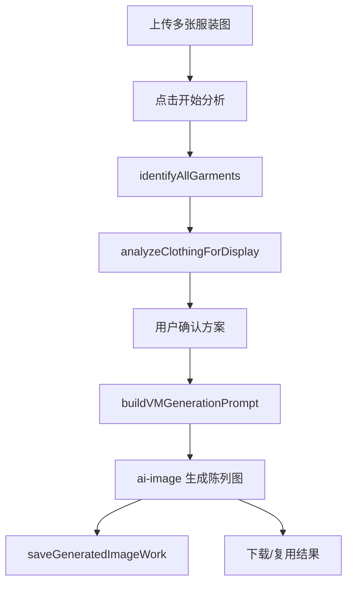
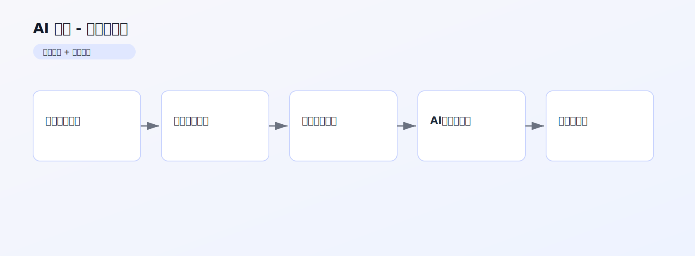

# AI 陈列 PRD 文档

> 产品需求文档 | 版本 1.0 | 最后更新：2026-02-13

## 1. 内容框架
- 输入层：多张服装图、场景类型（远景/中景/近景）、补充说明。
- 处理层：先识别单品，再输出陈列建议，再生成陈列参考图。
- 输出层：可执行陈列方案 + 对应视觉参考图。

## 2. 整体用途
- 给门店或电商团队提供“可落地的陈列方案”。
- 减少人工搭配试错，提高陈列效率与一致性。

## 3. 流程（用户流程 + 后端流程）
### 3.1 用户流程
1. 批量上传服装图片。
2. 发起分析，查看识别与陈列建议。
3. 确认方案并生成参考图。
4. 下载或复用结果。

### 3.2 后端流程
1. 调用 `identifyAllGarments` 逐件识别。
2. 调用 `analyzeClothingForDisplay` 输出陈列分析。
3. 调用 `buildVMGenerationPrompt` 组装生成 Prompt。
4. 调用 `ai-image` 生成陈列效果图。
5. 调用 `saveGeneratedImageWork` 保存作品。

### 3.3 流程图


## 架构图（图片版）



## 4. 核心提示词（新增）

### 4.1 单件识别 Prompt
来源：`src/lib/vm-analysis.ts`

```text
请描述这件衣服：颜色+款式+关键特征
输出：颜色款式、面料质感、大致长度、适合搭配类型
```

### 4.2 陈列分析 Prompt
来源：`src/lib/vm-analysis.ts`

```text
你是顶级女装陈列师。以下是店主这一杆挂杆上的 {clothingCount} 件衣服...
规则：
- 只能基于给定清单，不能编造衣服
- totalPieces = {clothingCount}
- 生成 arrangementSteps/pairingAdvice/heightRhythm/salesTalk 等
```

### 4.3 陈列成图 Prompt
来源：`src/lib/vm-prompt-builder.ts`

```text
A professional 8K photorealistic visual merchandising photograph...
- REFERENCE IMAGES: 编号总览图 + 每件单品图
- STAGGERED HEIGHTS: 下摆高度必须形成波浪节奏
- NO HUMAN MODELS
- COLOR FIDELITY: 颜色和材质严格一致
- 输出 4:3，无文字无水印
```
