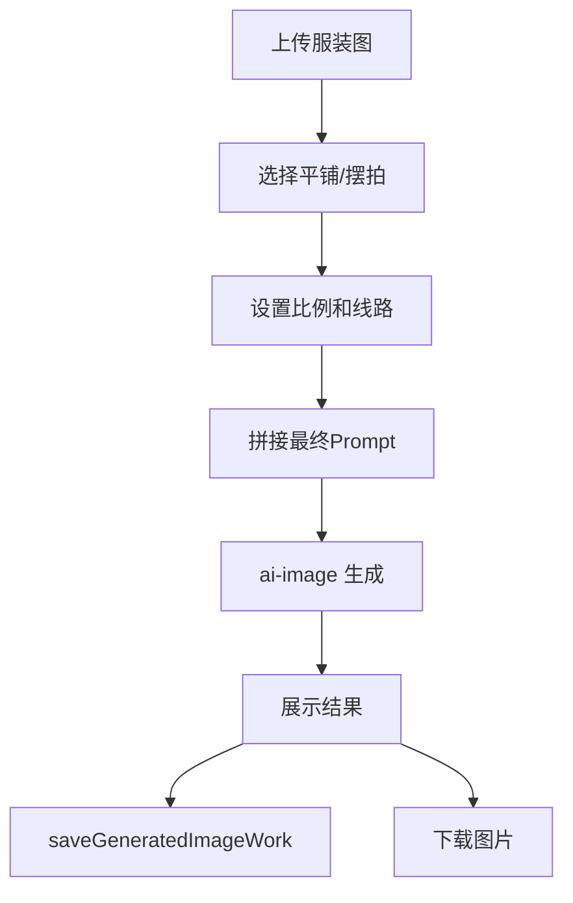
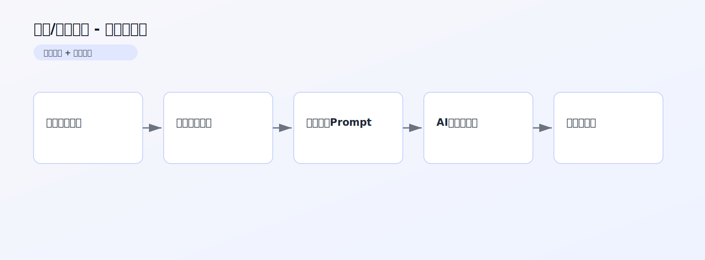

# 平铺/摆拍生成 PRD 文档

> 产品需求文档 | 版本 1.0 | 最后更新：2026-02-13

## 1. 内容框架
- 输入层：服装参考图（最多 5 张）+ 模式（平铺/人形摆拍）+ 比例/线路。
- 处理层：基于模式 Prompt + 用户补充说明拼接生成指令。
- 输出层：平铺图或摆拍氛围图。

## 2. 整体用途
- 快速生成服装详情页、种草页所需的平铺与摆拍视觉素材。
- 降低实拍成本，提高上新效率。

## 3. 流程（用户流程 + 后端流程）
### 3.1 用户流程
1. 上传服装参考图。
2. 选择生成模式与参数。
3. 输入补充说明后点击生成。
4. 预览并下载图片。

### 3.2 后端流程
1. 前端压缩图片并整理参数。
2. 组装模式 Prompt + 用户补充内容。
3. 调用 `ai-image` 生成结果。
4. 调用 `saveGeneratedImageWork` 自动保存。

### 3.3 流程图


## 架构图（图片版）



## 4. 核心提示词（新增）

来源：`src/lib/fashion-prompts.ts`

### 4.1 平铺模式 Prompt（`FASHION_OUTFIT_FLATLAY_PROMPT`）
```text
创建一张专业的女装平铺搭配图(flat lay)。
- 每件单品必须独立展示，网格布局，禁止重叠
- 智能添加一件女性配饰 + 一双女鞋
- 纯色高级背景，专业产品摄影质感
- 无文字、无水印、无模特，9:16
```

### 4.2 摆拍模式 Prompt（`FASHION_OUTFIT_OOTD_PROMPT`）
```text
创建一张OOTD穿搭摆拍图。
- 上衣在上、下装在中下、鞋在底部
- 要有自然动态感，不能僵硬对称
- 俯拍视角，真实地面背景，自然光
- 无文字、无水印，9:16
```
