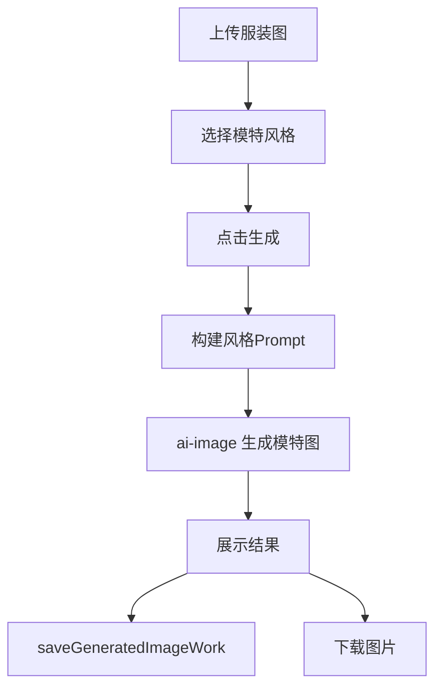

# 模特生成 PRD 文档

> 产品需求文档 | 版本 1.0 | 最后更新：2026-02-13

## 1. 内容框架
- 输入层：服装图 + 模式（自拍/标准模特/氛围半身/氛围近景）+ 比例/线路。
- 处理层：使用风格 Prompt 与用户补充内容生成上身效果图。
- 输出层：可用于商品页与社媒传播的模特上身图。

## 2. 整体用途
- 快速完成不同展示风格的上身图制作。
- 在无真人拍摄条件下完成模特图产出。

## 3. 流程（用户流程 + 后端流程）
### 3.1 用户流程
1. 上传服装参考图。
2. 选择模特生成风格。
3. 设置参数并生成。
4. 下载结果图。

### 3.2 后端流程
1. 前端压缩图片并确定风格 Prompt。
2. 拼接用户补充说明。
3. 调用 `ai-image` 生成模特图。
4. 调用 `saveGeneratedImageWork` 保存作品。

### 3.3 流程图


## 架构图（图片版）


## 4. 核心提示词（新增）

来源：`src/lib/fashion-prompts.ts`

### 4.1 标准模特（`FASHION_MODEL_STANDARD_PROMPT`）
```text
生成一张真实的时尚穿搭模特照片，要求极致真实。
- 中国女性模特，25-35岁
- 必须完整穿着上传单品（外套/内搭/下装）
- 自动搭配鞋和配饰
- 场景随穿搭风格匹配，竖版9:16
- 禁止畸形手指、塑料皮肤、AI痕迹
```

### 4.2 对镜自拍（`FASHION_MODEL_MIRROR_SELFIE_PROMPT`）
```text
Youthful mirror selfie，模型填满画面，年轻化发型与肤质。
强制包含上传服装与关键配饰，背景简洁高端。
```

### 4.3 氛围半身/近景（`FASHION_MODEL_FACELESS_HALF_PROMPT` / `...FULL...`）
```text
半身：从下巴到腰部，突出层次穿搭。
近景：极近距离拍摄面料细节，服装占画面90%-95%。
两种模式均强调 quiet luxury、低饱和、真实面料纹理。
```
