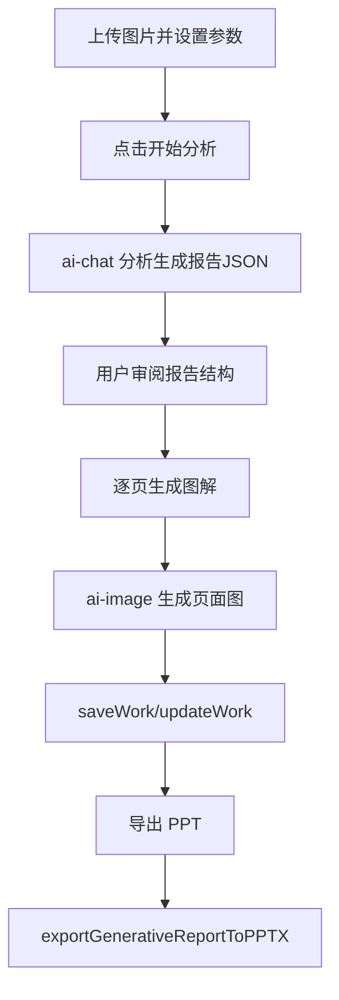

# 生成式报告 PRD 文档

> 产品需求文档 | 版本 1.0 | 最后更新：2026-02-13

## 1. 内容框架
- 输入层：多张业务图片、领域类型、报告深度、机构信息、补充说明。
- 处理层：先做结构化报告分析，再逐页生成图解页。
- 输出层：结构化报告文档、逐页图解、最终可导出的 PPT 报告。

## 2. 整体用途
- 用于“多图分析 + 讲解表达 + 报告交付”的完整链路。
- 适合医疗、教育、健身等场景的解释型报告制作。

## 3. 流程（用户流程 + 后端流程）
### 3.1 用户流程
1. 上传图片并设置报告参数。
2. 点击分析，查看自动生成的报告结构。
3. 逐页生成图解页并人工检查。
4. 一键导出可交付 PPT。

### 3.2 后端流程
1. 调用 `analyzeGenerativeReport`（经 `ai-chat`）生成报告 JSON。
2. 前端按报告页构建手绘图解 Prompt。
3. 调用 `ai-image` 逐页生成图解图。
4. 调用 `saveWork/updateWork` 保存草稿与导出状态。
5. 调用 `exportGenerativeReportToPPTX` 输出文件。

### 3.3 流程图


## 架构图（图片版）


## 4. 核心提示词（新增）

### 4.1 报告结构化分析系统 Prompt
来源：`supabase/functions/ai-chat/index.ts`（`GENERATIVE_REPORT_SYSTEM_PROMPT`）

```text
你是一位跨行业的视觉分析报告专家...
核心要求：
1) 必须基于用户上传图片分析
2) 只输出合法 JSON
3) 每一页必须包含 title/visual_focus_area/plain_language_explanation/key_metaphor/action_items/image_refs
4) plain_language_explanation 必须是通俗中文
5) action_items 必须可执行
6) 多图深度报告要包含 comparison 页
```

### 4.2 图解页生成 Prompt
来源：`src/pages/GenerativeReport.tsx`（`buildHandDrawnPagePrompt`）

```text
请把参考图做成一张 AI PPT 风格手绘图解页（4:3 横版，固定比例）。
必须保留参考图主体，但左侧图片宽度控制在25%-30%。
右侧至少70%画面用于文字重点，采用便签+箭头+图标布局。
文案用4条重点短句，每条8-18字。
页面标题：{title}
重点区域：{focusArea}
短句1-4：{observe}/{action}/{result}/{followup}
```

### 4.3 封面/结尾页 Prompt
来源：`src/pages/GenerativeReport.tsx`

```text
封面：请生成一张手绘风 PPT 封面图（4:3 横版），温暖专业，中文标题+机构名。
结尾：请生成一张手绘风 PPT 总结页（4:3 横版），一句总结标题 + 3条重点结论。
```
